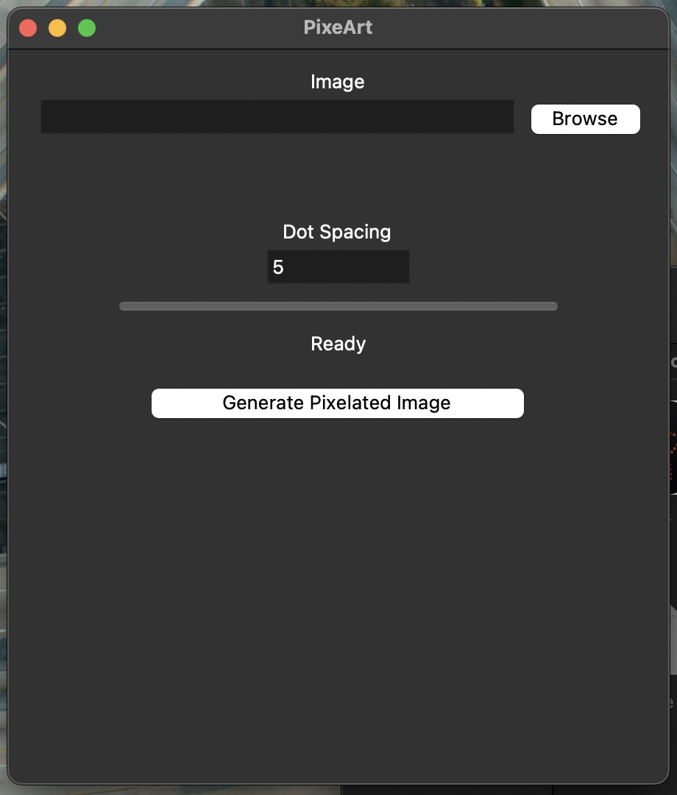
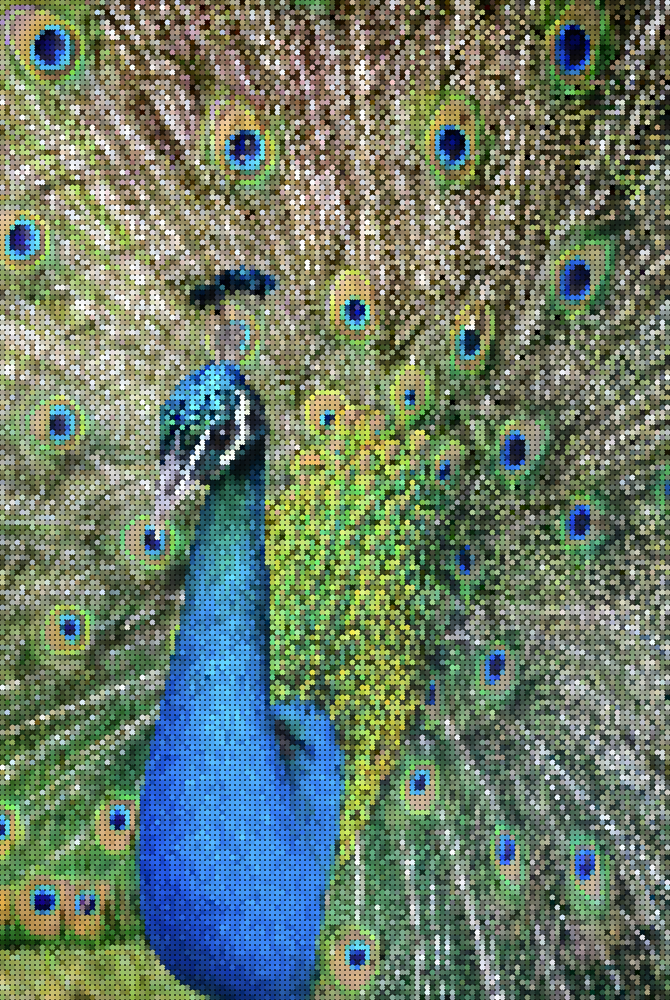
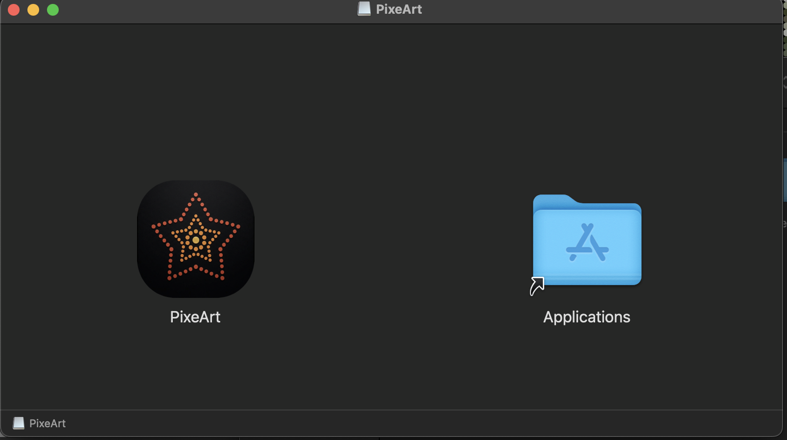

# PixeArt

Turn any image into beautiful pixel art mosaics.

## Screenshots

### Main Interface



## Features

-  Image Preview
-  Adjustable Dot Size
-  Progress Bar
-  PNG/JPG/WebP Export
-  Native macOS App

## Installation

### macOS

Download the latest release from Releases.

### Source

```bash
pip install -r requirements.txt
python main.py
```

## Gallery

### Main Interface


### Pixelated Output



### App in Action


### macOS Installer



## Future Plans

- LEGO Mosaic Mode
- Cross Stitch Patterns
- Minecraft Block Art
- Windows Release